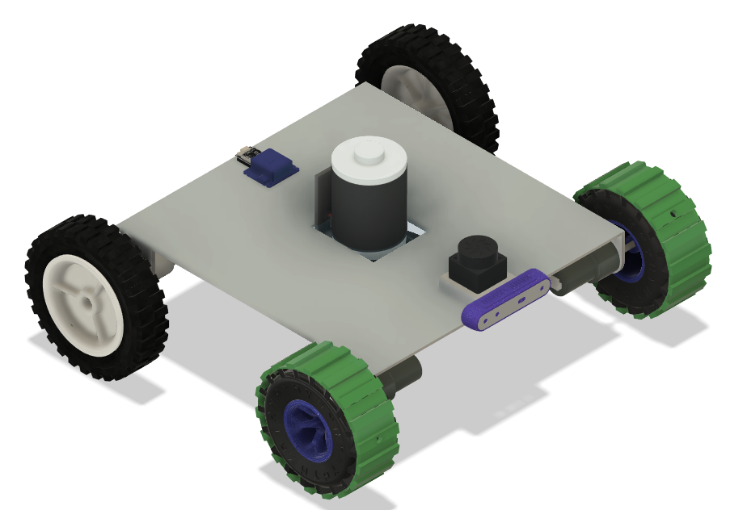
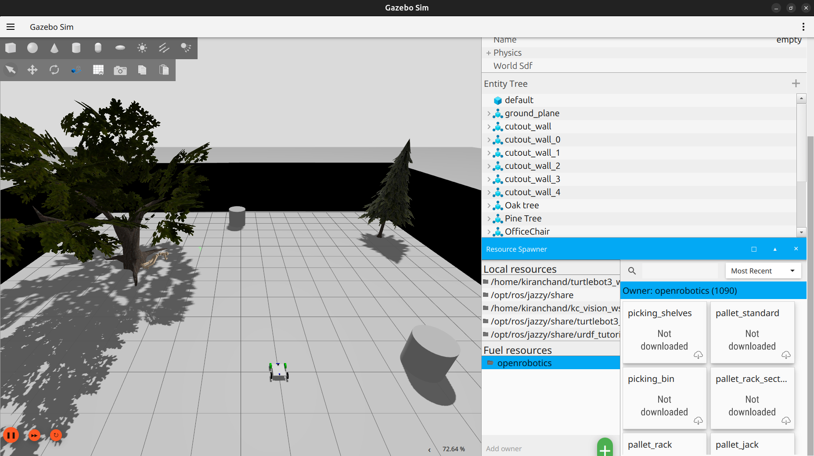
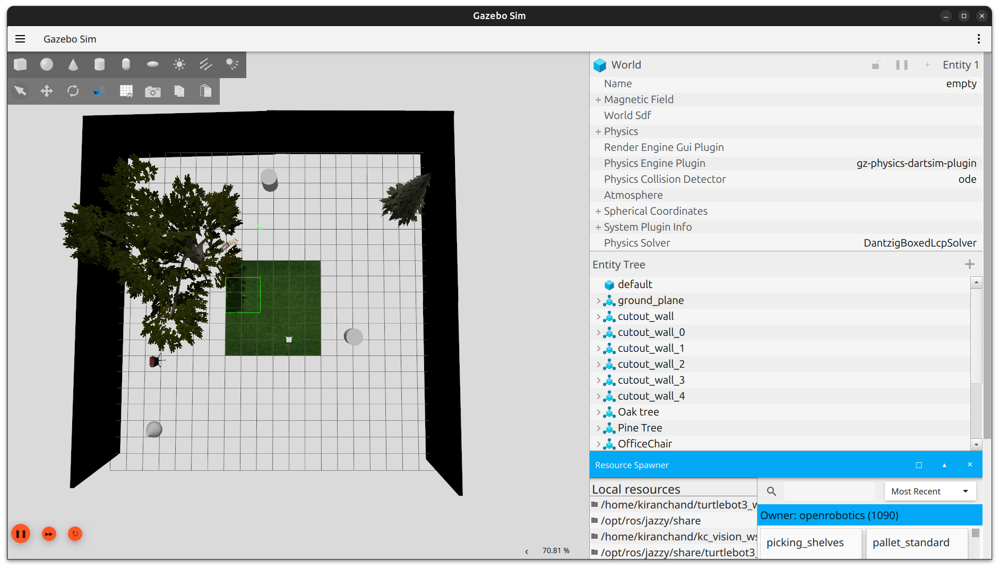
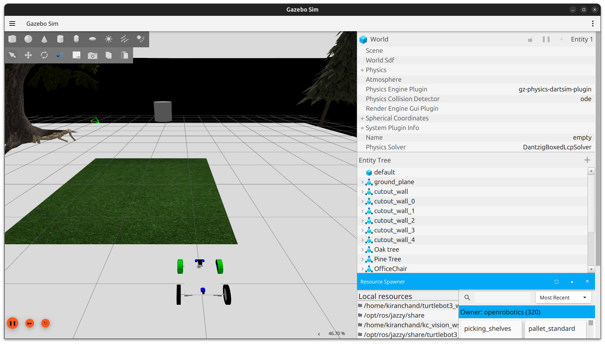
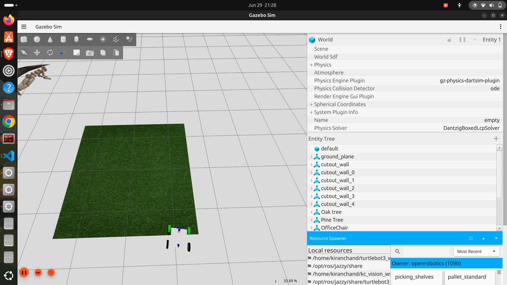
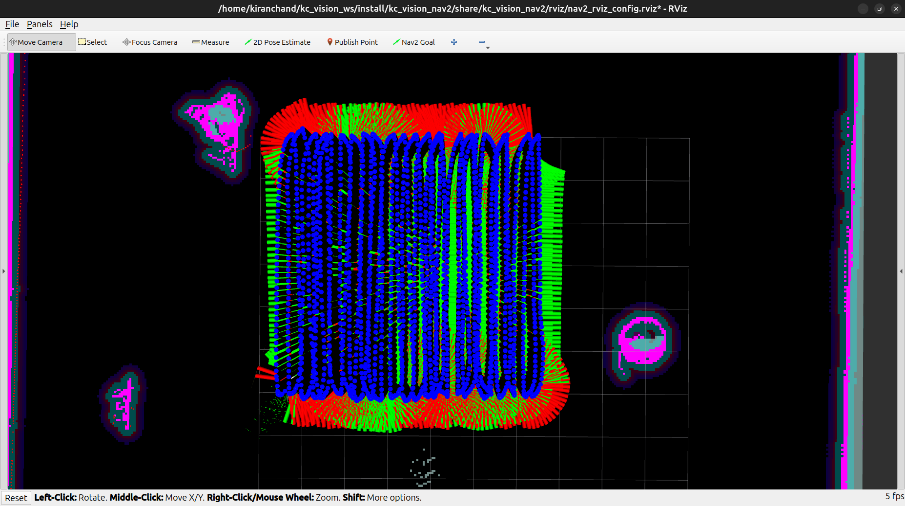
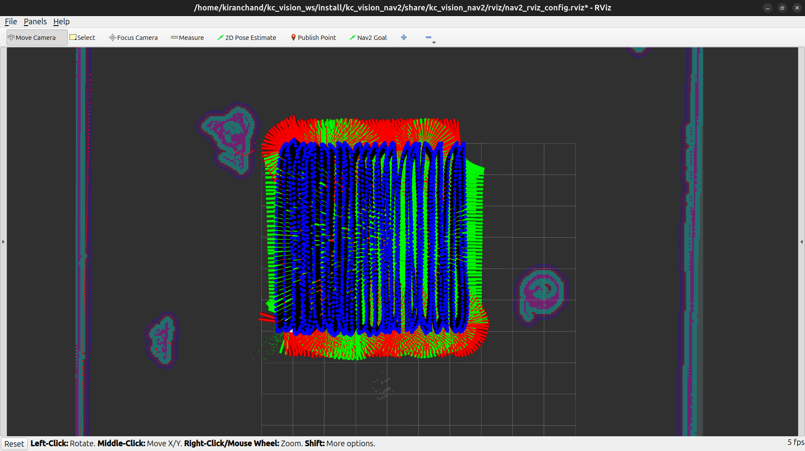
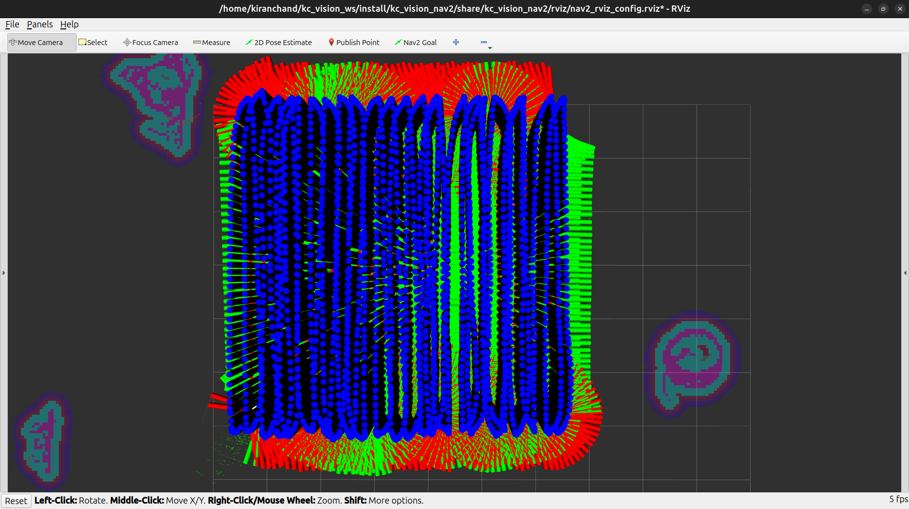
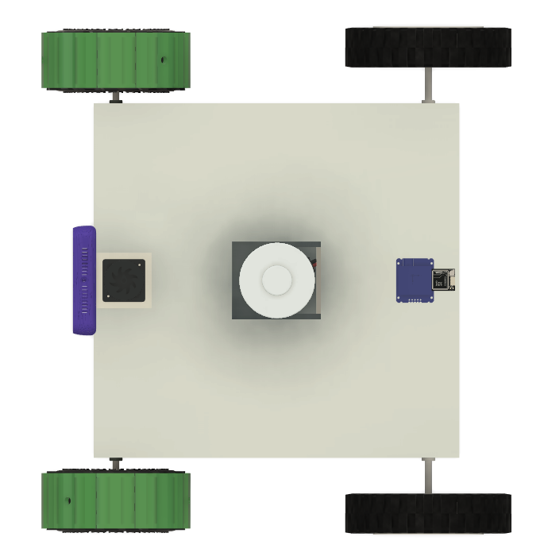
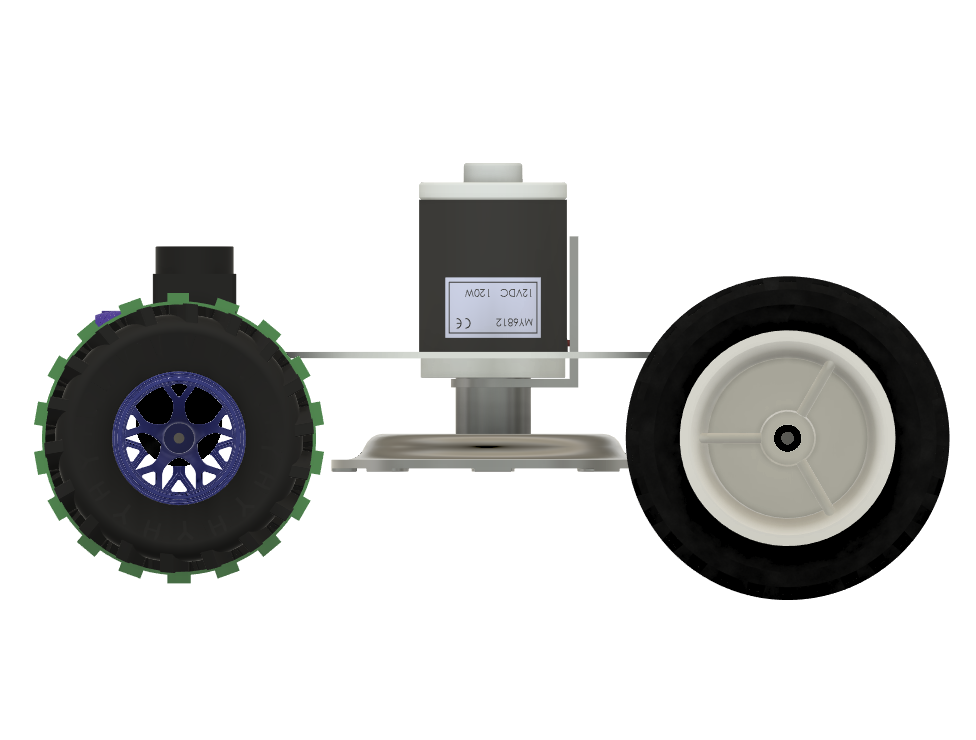

<div align="center">

# 🤖 kc_vision
### Autonomous Ground Robot — Custom-Designed with Fusion 360 + ROS 2

**A complete self-driving robot you can simulate, study, and eventually build in real life.**

[](https://docs.ros.org/en/jazzy/)
[](https://gazebosim.org/)
[](https://navigation.ros.org/)
[](https://github.com/SteveMacenski/slam_toolbox)
[](LICENSE)
[](https://ubuntu.com/)



</div>

---

## 🧐 What Is This Project?

Imagine a robot that can **see its surroundings, build its own map, and drive itself** to any point you click — without you touching a joystick.

<div align="center">


</div>

That's `kc_vision`. Every part of it was custom-built:

- The **body** was designed by hand in Fusion 360 
- The **brain** runs on ROS 2 — the same framework used by real robotics companies
- The **eyes** are LiDAR, a camera, GPS, and an IMU working together
- The **legs** are a differential-drive wheel system, just like a wheelchair turns

You can run this entire robot **in simulation right now** — no physical hardware needed. Everything happens inside your computer using Gazebo.

---

## ✨ What Can It Actually Do?

| Capability | In Plain Words |
|---|---|
| 🗺️ **Build its own map** | Drive it around once, and it remembers the space forever |
| 🧭 **Navigate on its own** | Click a point on the map, the robot finds its own path there |
| 🚧 **Avoid obstacles** | If something blocks its path, it reroutes automatically |
| 🛰️ **Follow GPS outdoors** | Works outside without needing a pre-made map |
| 🌾 **Mow lawns / cover areas** | Sweeps an entire field in neat rows — like a robotic lawnmower |

---

## 📂 How the Project Is Organized

Think of this like rooms in a house — each folder has one clear job.

```text
kc_vision_ws/
│
├── media/                    📸  Images and videos for documentation
│   ├── images/                  (Add your .png, .jpg files here)
│   └── videos/                  (Add your .mp4, .gif files here)
│
└── src/                      💻  All the ROS 2 packages live here
    │
    ├── kc_vision_description/    🦴  The robot's "skeleton" (3D model, shape, joints)
    ├── kc_vision_gazebo/         🌍  Virtual worlds the robot lives and drives in
    ├── kc_vision_localization/   📍  Helps the robot know exactly where it is
    ├── kc_vision_slam/           🗺️  Lets the robot build maps as it explores
    ├── kc_vision_nav2/           🧭  The "GPS app" that plans routes and drives
    ├── kc_vision_scripts/        🔧  Small helper tools (like a QR code reader)
    ├── kc_vision_hardware/       🛠️  (Coming soon) Code for the real physical robot
    │
    └── kc_vision_bringup/        ⭐ START HERE — every command you'll run lives here
        ├── launch/                  All the "press play" files
        ├── config/                  Settings and tuning files
        └── nav2_gps_waypoint_follower_demo/
            ├── gps_waypoint_logger.py     📍 Click-to-save GPS points
            ├── gps_coverage_planner.py    🌾 Plans the lawnmower sweep pattern
            └── logged_waypoint_follower.py 🚗 Drives to saved points in order
```

> 💡 **Beginner tip:** You will almost never need to open the other folders directly. `kc_vision_bringup` is your control panel for everything.

---

## 🌐 Choose Your Practice World

Before driving the real robot, you can test it in different virtual environments — like choosing a level in a video game.

| World | Good For |
|---|---|
| `empty_world.sdf` | Quick first test, nothing to crash into |
| `grass.sdf` | Practicing outdoor lawn navigation |
| `obs_grass.sdf` | Testing obstacle avoidance |
| `tree_grass.sdf` | Realistic outdoor terrain with trees |
| `indoor_world_with_qr_codes.sdf` | Indoor navigation with QR landmarks |
| `warehouse_world.sdf` | Industrial / logistics-style testing |
| `maze_world_1.sdf` | Stress-testing obstacle avoidance |
| `living_room.sdf` | Home-robot style testing |

**Gazebo World Previews:**
<p align="center">
  
  

</p>

---

## ⚙️ What You Need Before Starting

| Tool | Version |
|---|---|
| Ubuntu | 24.04 LTS |
| ROS 2 | Jazzy Jalisco |
| Gazebo | Harmonic |
| Python | 3.10 or newer |

You'll also need these ROS 2 packages — don't worry, the setup steps below install them automatically: `nav2_bringup`, `slam_toolbox`, `robot_localization`, `ros2_control`.

---

## 🚀 Getting Started (5 Minutes)

### Step 1 — Download the Project

```bash
# Tell your terminal where ROS 2 lives
source /opt/ros/jazzy/setup.bash

# Clone the repository (this creates the kc_vision_ws folder for you)
cd ~
git clone https://github.com/bingikiranchand932-hub/kc_vision_ws.git

# Go into the workspace and install all ROS dependencies
cd ~/kc_vision_ws
rosdep update
rosdep install --from-paths src --ignore-src -r -y
```

### Step 2 — Build It

```bash
colcon build --symlink-install
```

> 💡 The `--symlink-install` part means: if you edit a script later, you won't need to rebuild — it updates instantly.

### Step 3 — Activate It

```bash
source install/setup.bash
```

> 💡 **Save yourself time:** Add this same line to your `~/.bashrc` file so it runs automatically every time you open a terminal.

That's it — you're ready to drive your robot.

---

## 🎮 How To Use It — 4 Simple Modes

> ⚠️ Every command below is run from `kc_vision_bringup`. You never need to touch files inside the other folders.

---

### 🕹️ Mode 1 — Manual Driving (Easiest, Start Here)

This opens the simulator and lets you drive the robot yourself with your keyboard.

**Terminal 1:**
```bash
ros2 launch kc_vision_bringup sim_teleop_only.launch.py
```

**Terminal 2 (open a new tab):**
```bash
ros2 run teleop_twist_keyboard teleop_twist_keyboard
```

**Want to customize it?**

| Setting | Default | What It Changes |
|---|---|---|
| `world` | `grass.sdf` | Which virtual world loads |
| `robot_name` | `kc_vision` | The robot's name in Gazebo |
| `headless` | `false` | Set `true` to run with no graphics window |
| `using_joy` | `true` | Set `false` if you don't have a joystick |

---

### 🗺️ Mode 2 — Let It Build a Map

Drive around manually while the robot remembers everything it sees.

```bash
# Default option (SLAM Toolbox)
ros2 launch kc_vision_bringup sim_map_mode.launch.py

# OR use Google's Cartographer instead
ros2 launch kc_vision_bringup sim_map_mode.launch.py slam_type:=cartographer
```

Drive around with the teleop keyboard until the map looks complete, then save it:

```bash
ros2 run nav2_map_server map_saver_cli -f ~/my_maps/my_map
```

---

### 🧭 Mode 3 — Fully Autonomous Navigation

Now the robot drives itself using the map you just saved.

```bash
ros2 launch kc_vision_bringup sim_nav_mode.launch.py map:=/path/to/your/saved_map.yaml
```

In RViz, click the **"2D Goal Pose"** button, then click anywhere on the map. The robot will plan its own path and drive there — avoiding anything in its way.

**Navigation in Action:**


**Obstacle Avoidance:**


---

### 🛰️ Mode 4 — GPS Lawnmower Coverage (The Star Feature)

This is what makes `kc_vision` special: it can **sweep an entire outdoor area automatically**, like a robotic lawnmower — using only GPS, no map needed.

**How it works in plain steps:**
1. You mark the 4 corners of the area you want covered
2. The robot calculates the most efficient back-and-forth sweep pattern
3. It drives the entire pattern on its own

**Step 1 — Start the GPS simulation**
```bash
ros2 launch kc_vision_bringup gps_waypoint_follower.launch.py use_rviz:=True
```

**Step 2 — Mark your 4 corner points**

Open a new terminal:
```bash
ros2 run kc_vision_bringup gps_waypoint_logger.py src/kc_vision_bringup/config/demo_waypoints.yaml
```

A small window will pop up showing the robot's live GPS position. Drive to each of the **4 corners** of your area and click **"Log GPS Waypoint"** at each one.

Your saved file will look like this:
```yaml
waypoints:
- latitude: 17.72333775
  longitude: 78.09434301
  yaw: 0.0
- latitude: 17.72333782
  longitude: 78.09438629
  yaw: 0.0
- latitude: 17.72337955
  longitude: 78.09438700
  yaw: 0.0
- latitude: 17.72338038
  longitude: 78.09434389
  yaw: 0.0
```

**Step 3 — Let it sweep the entire area**
```bash
ros2 run kc_vision_bringup gps_coverage_planner.py
```

The robot will now automatically calculate parallel rows (0.2 m apart by default) and drive the entire pattern — covering 100% of the area with no gaps.

**Coverage Path Planning (Boustrophedon Pattern):**


<p align="center">
  
  
  
  
  
  
</p>

> 🔧 **Want tighter or wider rows?** Open `gps_coverage_planner.py` and change the `sweep_spacing` value.

---

## 📦 Quick Topic Reference

If you want to peek under the hood and see what data is flowing between parts of the robot:

| Topic | What It Carries |
|---|---|
| `/gps/fix` | Raw GPS location (latitude, longitude) |
| `/imu` | Orientation and tilt data |
| `/scan` | LiDAR distance readings |
| `/camera/image_raw` | Live camera feed |
| `/cmd_vel` | Drive commands (speed and turn) |
| `/odom` | Wheel-based position tracking |
| `/odometry/filtered` | Cleaned-up, more accurate position |
| `/map` | The map the robot has built |

---

## 🏗️ From Simulation to Real Robot

> 🔬 **Right now, everything above runs in simulation.** The physical robot is being built in parallel.

The mechanical design is already finished in Fusion 360. Here's what the real hardware will look like:

<p align="center">
  
  
</p>

| Part | Component |
|---|---|
| 🧠 Main Computer | Raspberry Pi 5 |
| ⚙️ Motor Controller | STM32 (via micro-ROS) |
| 🛞 Drive System | Differential drive with encoded DC motors |
| 👁️ LiDAR | RPLidar A1 |
| 🧭 IMU | MPU6050 |
| 📷 Camera | RGB Camera |
| 🛰️ GPS | NEO-M8N module |

Once the hardware is assembled, this same README will be updated with `real_teleop_only.launch.py`, `real_map_mode.launch.py`, and full micro-ROS setup instructions.

---
## 🤝 Want to Contribute?

Found a bug? Have an idea? Contributions are genuinely welcome.

1. Fork this repository
2. Create your own branch: `git checkout -b feature/your-idea`
3. Make your changes and commit: `git commit -m 'feat: describe what you added'`
4. Push it: `git push origin feature/your-idea`
5. Open a Pull Request

Please try to follow the standard [ROS 2 code style guide](https://docs.ros.org/en/jazzy/The-ROS2-Project/Contributing/Code-Style-Language-Versions.html).

---

## 📝 License

This project is licensed under the **Apache License 2.0** — see the [LICENSE](LICENSE) file for full details.

---

## 🙏 Acknowledgements

Huge thanks to **[Ben May](https://benmay.co.uk/)** and his [slambot](https://github.com/benmay100/slambot) project, which served as a major reference for how this project's architecture and launch files were structured.

This project also stands on the shoulders of incredible open-source work:

- [Nav2 — Navigation2](https://navigation.ros.org/) — the gold standard for ROS 2 navigation
- [SLAM Toolbox](https://github.com/SteveMacenski/slam_toolbox) — by Steve Macenski
- [cartographer_ros](https://github.com/ros2/cartographer_ros) — Google's mapping engine for ROS 2
- [robot_localization](https://github.com/cra-ros-pkg/robot_localization) — sensor fusion that keeps the robot's position accurate
- [ros2_control](https://control.ros.org/) — hardware abstraction and motor control
- [micro-ROS](https://micro.ros.org/) — bringing ROS 2 to small microcontrollers

---

<div align="center">

**Made with ❤️ and a lot of `colcon build`**

*kc_vision · ROS 2 Jazzy*

</div>